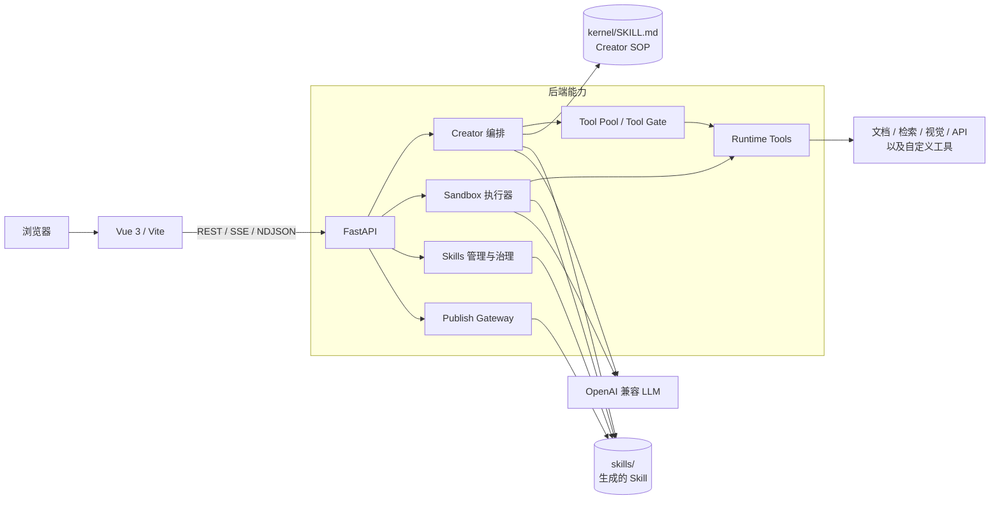
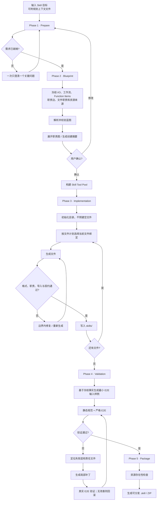
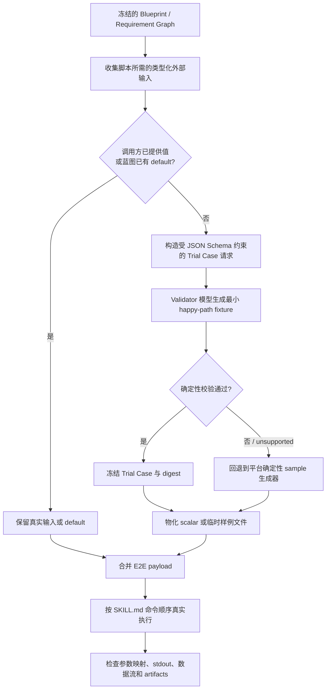
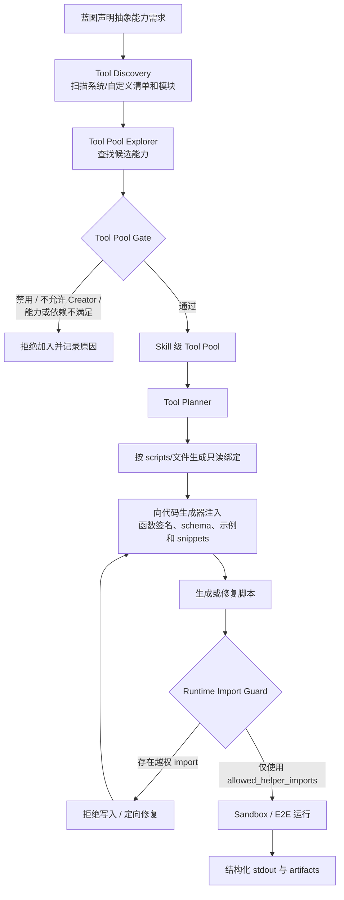
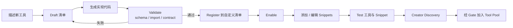

# SuperSkills · Skill Creator Factory

> 一个面向 AI Skill 全生命周期的本地优先平台：用 Creator 把需求变成可执行 Skill，用工具注册中心为脚本提供受控能力，再通过 Sandbox 验证、治理并发布为 OpenAI 兼容接口。

## 目录

- [项目能力](#项目能力)
- [系统架构](#系统架构)
- [Creator：从需求到 Skill](#creator从需求到-skill)
- [工具系统：发现、绑定与运行](#工具系统发现绑定与运行)
- [快速开始](#快速开始)
- [使用指南](#使用指南)
- [Skill 目录与规范](#skill-目录与规范)
- [配置说明](#配置说明)
- [API 概览](#api-概览)
- [开发与测试](#开发与测试)

## 项目能力

| 模块 | 能力 |
| --- | --- |
| **Creator** | 对话式需求澄清、蓝图和职责图生成、文件逐项生成、严格校验、E2E 自动修复、打包；支持上传规划上下文和静态素材 |
| **Creator 工具池** | 从系统清单、自定义清单和 Python 模块发现工具；按 Skill 和文件绑定工具；通过 Gate 限制生成代码可导入的运行时 helper |
| **工具注册中心** | 工具草拟、代码生成、校验、注册、启停、编辑、删除、测试；支持可复用 snippet 的增删改查与测试 |
| **模型配置** | 为 Creator 的 planner、reviewer 等角色配置模型档案，支持文本、代码、验证、视觉和图像模型分工 |
| **Sandbox** | 加载已安装 Skill，规划单 Skill/多 Skill 工作流，上传运行输入，流式执行并渲染文本与产物 |
| **Skills 管理** | Skill CRUD、资源编辑、ZIP 导入/升级、版本快照与回滚、allowlist、审批状态和审计事件 |
| **Publish** | 将获准的 Skill 配置成端点，并通过 `/published/v1/chat/completions` 暴露 OpenAI 兼容调用方式 |
| **本地优先** | FastAPI + Vue 3；兼容 Ollama、LM Studio 及其他 OpenAI 兼容模型服务；Docker Compose 一键启动 |

## 系统架构



### 仓库结构

```text
superskills/
├── backend/
│   ├── main.py                         # FastAPI 入口与路由装配
│   ├── routers/                        # Creator、Sandbox、Skills、Publish API
│   ├── services/
│   │   ├── creator/                    # Creator 计划、生成、修复、E2E 与 Tool Pool
│   │   ├── runtime_tools/              # 平台运行时工具及自定义工具
│   │   ├── creator_tool_registry.py    # 工具发现、校验、注册、测试
│   │   ├── skill_governance.py         # 状态、allowlist、版本与审计
│   │   └── skill_runtime.py            # Skill 可调用的平台 helper
│   └── config/                         # 工具发现、系统清单和自定义清单
├── frontend/src/
│   ├── views/                          # Creator / Skills / Sandbox / Publish / Tools
│   ├── components/                     # 任务、职责图、执行图、结果等组件
│   └── composables/                    # Creator、Sandbox、Publish 状态与请求封装
├── kernel/
│   ├── SKILL.md                        # Creator 的分阶段 SOP 与约束
│   ├── references/                     # 工作流、交互和最佳实践
│   └── scripts/                        # 初始化、快速校验、打包 CLI
├── skills/                             # 用户 Skill 工作区
└── docker-compose.yml
```

## Creator：从需求到 Skill

Creator 不只是“让模型一次性写几个文件”。它把用户意图转换为结构化事实、职责关系和文件计划，再在受控工具上下文内逐文件生成，并用真实运行结果闭环修复。

### 完整流程图



### 五个阶段

1. **Prepare（需求解析）**：抽取输入、输出、工作流、依赖、运行时输入与 Creator 静态素材；信息不足时只询问当前最关键的问题。
2. **Blueprint（蓝图）**：形成可解析的 SkillPlan，明确 Function Item、责任边、每个文件的唯一职责、资源来源和输出契约。蓝图确认后，文件集合成为下游生成的权威边界。
3. **Implementation（实现）**：创建目录，按计划逐文件生成和写入。脚本生成前先取得该文件的工具绑定，代码不能把整个运行时工具命名空间当作自由可用。
4. **Validation（验证与迭代）**：进行格式、资源、命令、导入、数据流和 E2E 校验；自动修复以局部实验推进，失败或无改善的补丁会被拒绝或回滚。
5. **Packaging（打包）**：再次检查引用资源和端到端可用性，随后生成分发包。

### E2E 如何由模型创建输入 sample

严格 E2E 在执行 Skill 前会准备一个 **Trial Case**。这不是固定塞入一段通用文本：系统先从已冻结的蓝图、Requirement Graph、脚本接口和平台输入边中收集缺失的类型化外部输入，再让 Validator 模型只生成满足这些事实的最小 happy-path sample。



模型生成 sample 时受到以下边界约束：

- **只补缺失输入**：调用方已经传入的 `external_context`、蓝图 `default_values` 或显式 sample 会被优先保留，不会被模型覆盖。
- **不能重新规划 Skill**：模型只接收冻结后的输入名称、shape、目标脚本和对应 requirement ID；系统提示明确禁止修改需求、接口、工具、脚本或蓝图。
- **严格绑定 schema**：标量仅允许 `string`、`number`、`integer`、`boolean`；文件输入可生成 `txt`、`md`、`pdf`、`docx`、`json`、`csv`，文件列表最多 3 个。
- **内容也会被校验**：例如 CSV 必须声明列名、类型和 nullable，并提供类型匹配的行；JSON 必须可序列化；文本类文件必须包含非空内容。模型结果未通过确定性校验或返回 `unsupported` 时，系统改用类型驱动的 fallback sample。
- **样例会物化后再真实执行**：文件 fixture 写入 E2E 隔离工作区的 `.creator_e2e/samples/`，随后被填入命令 payload；PDF、DOCX、CSV、JSON 等不是伪路径，而是实际创建的最小文件。
- **同一修复会话保持输入稳定**：通过校验的 Trial Case 会冻结并记录 digest，后续 E2E 修复轮次复用同一份 sample，避免输入漂移干扰补丁效果判断。
- **不污染 Skill 资产**：这些 sample 是 `synthetic_fixture`，只用于隔离 E2E 试运行，不属于 `assets/**`，也不代表用户真实数据。

对于没有可推导业务字段的顶层文本 envelope，平台仍会提供一段通用中英混合测试文本，用来验证参数传递、脚本消费和输出闭环；它不会凭空补出 `theme`、`topic` 等业务字段。

### Creator 中的三类文件

- **`SKILL.md`**：Skill 的触发方式、工作流、命令及结果消费规则。
- **`scripts/**`**：承担可执行、可测试的实质职责，可以使用当前文件绑定允许的工具。
- **`references/**` / `assets/**`**：前者是按需阅读的知识，后者是静态模板或素材；二者都不是运行时工具，也不能声明工具调用。

> Creator 上传的“上下文文件”只服务于创建阶段，不会自动成为 Skill asset。只有在蓝图中确认的静态素材才会被复制到 `assets/**`。Sandbox 中用户上传的文件属于运行时输入，也不应写成 Creator 静态素材。

## 工具系统：发现、绑定与运行

### 工具从哪里来

工具发现由 `backend/config/creator_tool_discovery.json` 驱动，当前包含两类来源：

1. **清单（registries）**
   - `backend/config/creator_system_tool_manifests.json`：系统工具清单。
   - `backend/config/tool_registry.custom.json`：通过工具注册中心写入的自定义清单。
2. **Python 模块（modules）**
   - `backend.services.runtime_tools` 下的 API、文档、检索、视觉、微信及自定义工具。
   - `backend.services.skill_runtime` 暴露的文本生成、图像生成等平台 helper。

每个工具清单可以描述 `tool_id`、用途、是否启用、Creator 可用性、能力标签、输入/输出 schema、副作用、依赖、可调用函数，以及正确用法 snippet。

### 工具选择与执行流程



### 为什么同时需要 Tool Pool、文件绑定和 Import Guard

- **Tool Pool 是 Skill 级候选集合**：记录这个 Skill 被批准使用哪些工具，而不是让所有脚本默认拥有全部工具。
- **文件绑定是最小授权**：每个 `scripts/**` 文件只获得完成自身职责所需的 helper、函数签名和调用契约。
- **Tool Gate 是准入控制**：工具未启用、未允许 Creator 使用、能力不匹配或依赖缺失时，不能进入生成上下文。
- **Import Guard 是落地校验**：生成、修复和 E2E 阶段都不能重新引入已拒绝或未绑定的 helper。
- **Snippet 是调用知识**：它向模型提供已验证的最小调用范式、返回值规则和常见错误，避免“函数存在但调用方式错误”。

### 工具注册中心工作流



在前端访问 **`/creator/tools`** 可以完成工具的查看、创作、注册、启停和测试；**`/creator/model-profiles`** 用于管理 Creator 角色模型配置。新增工具后，先完成校验和测试，再允许 Creator 使用。

## 快速开始

### 前置条件

- Docker 与 Docker Compose（推荐），或 Python 3.11+、Node.js 18+。
- 一个可访问的 OpenAI 兼容文本模型服务，例如 Ollama 或 LM Studio。
- 若使用视觉或图像能力，还需配置相应模型服务；只创建文本 Skill 时可以不配置。

### Docker Compose（推荐）

```bash
git clone <your-repository-url> superskills
cd superskills

# 可选：在仓库根目录创建 .env，覆盖 compose 默认值
cat > .env <<'ENV'
LLM_BASE_URL=http://host.docker.internal:11434
DEFAULT_MODEL=qwen3:30b
TEXT_MODEL=qwen3:30b
CODE_MODEL=qwen3-coder:30b
ENV

docker compose up --build
```

| 服务 | 地址 |
| --- | --- |
| Web UI | <http://localhost:5173> |
| 后端 API | <http://localhost:58000> |
| Swagger | <http://localhost:58000/docs> |
| Published API | <http://localhost:58000/published/v1> |

Compose 会把 `kernel/` 只读挂载，把 `skills/` 和 `logs/` 持久化，并通过 `host.docker.internal` 访问宿主机模型服务。当前 compose 含 NVIDIA GPU 设备预留；没有对应 GPU 或设备编号时，请按本机环境移除或调整 `deploy.resources.reservations.devices`。

### 本地开发

```bash
# 后端：从仓库根目录启动
python -m venv .venv
source .venv/bin/activate
pip install -r backend/requirements.txt
cp backend/.env.example backend/.env
uvicorn backend.main:app --reload
```

```bash
# 前端：另开终端
cd frontend
npm install
npm run dev
```

本地启动的后端默认是 `http://localhost:8000`；前端开发服务器会按 `frontend/vite.config.js` 中的代理配置访问 API。

## 使用指南

### 创建一个 Skill

1. 打开 **Creator**，描述目标、输入示例、期望输出以及不可替代的外部依赖。
2. 根据界面提示补齐关键问题；需要时上传仅供规划参考的上下文文件。
3. 检查蓝图摘要、职责图、文件计划和静态素材清单，然后确认。
4. 观察执行面板：Creator 会初始化目录、构建工具池、逐文件生成并校验。
5. 运行严格验证；若失败，查看 E2E 诊断和自动修复事件。
6. 验证通过后打包，或转到 **Sandbox** 做交互测试。

### 在 Sandbox 验证

1. 在 **Skills** 中确认目标 Skill 可见且状态允许执行。
2. 打开 **Sandbox** 并选择一个或多个 Skill。
3. 上传本次运行输入（如有），输入真实测试任务。
4. 检查规划、命令执行、stdout、最终回答及输出文件链接。
5. 返回 Creator 或 Skills 编辑器修正问题，再重新验证。

### 治理与发布

1. 在 **Skills** 中导入、编辑或升级 Skill，并完成审批/启用。
2. 使用版本历史和事件记录审查变更；需要时回滚到历史快照。
3. 打开 **Publish**，选择获准 Skill 创建端点并启用。
4. 调用 `GET /published/v1/models` 查看模型，再向 `POST /published/v1/chat/completions` 发送 OpenAI 风格请求。

## Skill 目录与规范

```text
skills/my-skill/
├── SKILL.md              # 必需：frontmatter + 执行指令
├── scripts/              # 可选：Python / Bash 等可执行实现
├── references/           # 可选：按需加载的参考资料
├── assets/               # 可选：静态模板、样例和素材
├── outputs/              # 运行产物（如该 Skill 产生文件）
└── .creator/             # Creator 内部计划、工具池等状态
```

最小 `SKILL.md`：

```markdown
---
name: my-skill
# 清楚说明做什么，以及在什么用户意图下触发
description: Analyze a supplied report and return a structured summary.
---

# My Skill

## 执行方式

1. 检查输入。
2. 按约定执行工作流。
3. 返回结构化结果及产物链接。
```

名称建议使用小写字母、数字和连字符。不要用 `helper`、`utils`、`tools` 等模糊文件名掩盖职责；一个脚本应有明确的输入、输出、失败边界和可验证责任。

### 内核 CLI

```bash
# 初始化
python kernel/scripts/init_skill.py my-skill --path skills/

# 快速检查 frontmatter 和目录规范
python kernel/scripts/quick_validate.py skills/my-skill

# 打包
python kernel/scripts/package_skill.py skills/my-skill dist/
```

## 配置说明

常用环境变量如下；Compose 中的完整默认值以 `docker-compose.yml` 为准。

| 变量 | Compose 默认值 | 用途 |
| --- | --- | --- |
| `LLM_BASE_URL` | `http://host.docker.internal:11434` | OpenAI 兼容文本模型服务 |
| `DEFAULT_MODEL` | `qwen3:30b` | 未指定角色时的默认模型 |
| `TEXT_MODEL` | `qwen3:30b` | 文本生成模型 |
| `CODE_MODEL` | `qwen3-coder:30b` | Creator 文件/代码生成模型 |
| `PLANNER_MODEL` | `qwen3:30b-instruct` | 规划角色模型 |
| `VALIDATOR_MODEL` | `qwen3:8b` | 验证角色模型 |
| `VISION_MODEL` | `qwen3-vl:32b` | 视觉理解模型 |
| `EMBEDDING_MODEL` | `bge-m3:latest` | 检索向量模型 |
| `IMAGE_BASE_URL` | `http://host.docker.internal:11435` | 图像模型服务 |
| `IMAGE_MODEL` | `stable-diffusion-2-1-base` | 图像生成模型 |
| `LLM_API_KEY` / `OPENAI_API_KEY` | 空 | 云端或需鉴权的兼容服务密钥 |
| `MODEL_ROUTING_JSON` | 空 | 自定义模型路由 |
| `SKILL_COMMAND_TIMEOUT` | `180` | Skill 命令超时（秒） |
| `LLM_TIMEOUT_SECONDS` | `6000` | 模型请求超时（秒） |
| `MAX_TOKENS` | `4096` | 默认最大生成 token |

## API 概览

完整 schema 请以运行时 Swagger 为准。

### Creator

| 方法 | 路径 | 作用 |
| --- | --- | --- |
| `POST` | `/api/chat/creator` | Creator 分阶段对话（SSE） |
| `POST` | `/api/creator/prepare-plan` | 生成结构化创建计划 |
| `POST` | `/api/creator/prepare-plan/stream` | 以 NDJSON 推送计划事件 |
| `POST` | `/api/creator/analyze-blueprint` | 解析并严格检查蓝图 |
| `POST` | `/api/creator/upload-context-file` | 上传创建阶段上下文 |
| `POST` | `/api/creator/init-from-blueprint` | 按蓝图初始化目录 |
| `POST` | `/api/creator/generate-file` | 在职责和工具绑定下生成单文件 |
| `POST` | `/api/creator/write-file` | 校验后写入单文件 |
| `POST` | `/api/creator/validate-skill` | 严格 E2E 校验及可选自动修复 |
| `POST` | `/api/creator/package-skill` | 校验并打包 Skill |

### Creator 工具

| 方法 | 路径 | 作用 |
| --- | --- | --- |
| `GET` | `/api/creator/tools` | 列出已发现工具 |
| `POST` | `/api/creator/tools/draft` | 草拟工具 manifest |
| `POST` | `/api/creator/tools/author/stream` | 流式创作工具 |
| `POST` | `/api/creator/tools/validate` | 校验工具定义和实现 |
| `POST` | `/api/creator/tools/register` | 注册到自定义清单 |
| `PATCH` | `/api/creator/tools/{name}` | 更新工具 |
| `POST` | `/api/creator/tools/{name}/test` | 测试工具 |
| `POST` | `/api/creator/tools/{name}/enable` | 启用工具 |
| `POST` | `/api/creator/tools/{name}/disable` | 停用工具 |
| `GET/POST` | `/api/creator/tools/{name}/snippets` | 查询或新增调用片段 |
| `POST` | `/api/creator/tools/{name}/snippets/{id}/test` | 测试调用片段 |

### Skills、Sandbox 与 Publish

| 方法 | 路径 | 作用 |
| --- | --- | --- |
| `GET/POST` | `/api/skills` | 列出或保存 Skill |
| `POST` | `/api/skills/import` | ZIP 导入 |
| `POST` | `/api/skills/{name}/upgrade` | ZIP 升级并创建版本记录 |
| `POST` | `/api/skills/{name}/rollback` | 回滚历史版本 |
| `POST` | `/api/skills/{name}/status` | 审批、隔离、启停等状态迁移 |
| `POST` | `/api/chat/sandbox/{name}` | 执行 Sandbox 对话 |
| `GET/POST` | `/api/publish/configs` | 查询或创建发布配置 |
| `GET` | `/published/v1/models` | 查询已发布模型 |
| `POST` | `/published/v1/chat/completions` | OpenAI 兼容调用入口 |

## 开发与测试

```bash
# 后端内核脚本测试
python -m unittest discover -s kernel/scripts -p 'test_*.py'

# 前端单元测试
cd frontend && npm test

# 前端生产构建
cd frontend && npm run build
```

## License

内核代码的许可条款见 [`kernel/LICENSE.txt`](kernel/LICENSE.txt)；同时请留意仓库中各子目录或第三方依赖附带的许可证文件。
